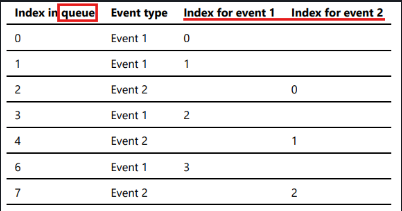

##### Purpose 
- create a new service that consumes message from Kafka

##### Part 1 - Understand Analyzer Service (Definition)
- function:
	- inspect Kafka message queue
	- run statistics on the events
- three endpoints:
	- `/1st-event?index=<NUMBER>`: return the event of 1st type at index `NUMBER` in Kafka queue
	- `/2nd-event?index=<NUMBER>`: return the event of 2nd type at index `NUMBER` in Kafka queue
	- `/stats`: return statistics about the events

##### Part 2 - OpenAPI YAML file in Analyzer
- create a new project directory - `analyzer`
- create a new OpenAPI YAML file in the directory
- write the YAML file to match the part 1 definition
	- first two GET endpoints have a **query parameter** for index value
	- first two GET endpoints return the requested message if it exists or `404` if not found
	- `/stats` endpoint returns a JSON object containing counts of each event in the queue
	- example of the JSON file returned by `/stats` endpoint
		```JSON
		{
			"user_activity": 22,
			"user_match": 33
		}
		```
- example of OpenAPI file 
	```YAML
	openapi: 3.0.0
	info:
	  description: This API provides audit info
	  version: "1.0.0"
	  title: Audit API
	  contact:
		email: mmulder10@bcit.ca
	
	paths:
	  /blood_pressure:
		get:
		  summary: gets a blood pressure reading from history
		  operationId: app.get_blood_pressure_reading
		  parameters:
			- name: index
			  in: query
			  description: Gets the BP at the index in the event store
			  schema:
				type: integer
				example: 100
		  responses:
			'200':
			  description: Successfully returned a blood pressure event
			  content:
				application/json:
				  schema:
					$ref: '#/components/schemas/BloodPressureReading'
			'400':
			  description: Invalid request
			  content:
				application/json:
				  schema:
					type: object
					properties:
					  message:
						type: string
			'404':
			  description: Not Found
			  content:
			    applications/json:
			      schema:
			    	type: object
			    	properties:
			    	  message:
			    		type: string
	  /heart_rate:
		get:
		  summary: gets a heart rate reading from history
		  operationId: app.get_heart_rate_reading
		  description: Gets heart rate reading from the event store
		  parameters:
		  - name: index
			in: query
			description: Gets the HR at the index in the event store
			schema:
			  type: integer
			  example: 100
		  responses:
			'200':
			  description: Successfully returned a heart rate event
			  content:
				application/json:
				  schema:
					$ref: '#/components/schemas/HeartRateReading'
			'400':
			  description: Invalid request
			  content:
				application/json:
				  schema:
					type: object
					properties:
					  message:
						type: string
			'404':
			  description: Not Found
			  
	  /stats:
		get:
		  summary: gets the event stats
		  operationId: app.get_event_stats
		  description: Gets the stats of the history events
		  responses:
		    '200':
			  description: Successfully returned a heart rate event
			  content:
				application/json:
				  schema:
					$ref: '#/components/schemas/Stats'
	
	components:
	  schemas:
		BloodPressureReading:
		  type: object
		  required:
		  - patient_id
		  - device_id
		  - blood_pressure
		  - timestamp
		  properties:
			patient_id:
			  type: string
			  format: uuid
			  example: d290f1ee-6c54-4b01-90e6-d701748f0851
			device_id:
			  type: string
			  example: A12345
			blood_pressure:
			  $ref: '#/components/schemas/BloodPressure'
			timestamp:
			  type: string
			  format: date-time
			  example: 2016-08-29T09:12:33.001Z
		
		HeartRateReading:
		  type: object
		  required:
		  - patient_id:
		  - device_id
		  - heart_rate
		  - timestamp
		  properties:
			patient_id:
			  type: string
			  format: uuid
			  example: d290f1ee-6c54-4b01-90e6-d701748f0851
			device_id:
			  type: string
			  example A12345
			heart_rate:
			  type: integer
			  example: 85
			timestamp:
			  type: string
			  format: date-time
			  example: 2016-08-29T09:12:33.001Z
			
		BloodPressure:
		  type: object
		  required:
		  - systolic
		  - diastolic
		  properties:
			systolic:
			  type: integer
			  example: 120
			diastolic:
			  type: integer
			  example: 80
		
		Stats:
		  required:
		  - num_bp
		  - num_hr
		  properties:
		    num_bp:
		      type: integer
		      example: 100
		    num_hr:
		      type: integer
		      example: 100
	```

##### Part 3 - Coding Analyzer
- create a new `app.py` 
- user proper configuration and logging (similar to previous services)
- an example of retrieving a single even from the queue
	```python
	def get_snow(index):
		client = KafkaClient(hosts=CONFIG["kafka"]["hostname"])
		topic = client.topics[CONFIG["kafka"]["topic"].encode()]
		consumer = topic.get_simple_consumer(
			reset_offset_on_start = True,
			consumer_timeout_ms = 1000
		)
	
		counter = 0
		for msg in consumer:
			message = msg.value.decode("utf-8")
			data = json.loads(message)
			# Look for index requested an retrun the payload with 200 status code
		
		return { "message": f"No message at index {index}!"}, 404
	```

- **CLARIFICATION !!!**
	- Kafka message queue stores all message in a single queue
		- meaning → two event types will be mixed up
	- event 1 has its **own** index going from `0, 1, 2, ..., n`
	- event 2 has its **own** index going from `0, 1, 2, ..., n`
	- each index in Kafka queue is only matched to **one** event (either event 1 or 2, not both!!!)
	- ==**IMPORTANT!!!**==
	- 
		- `/event1?index=3` → index 6 in Kafka queue (= index 3 for event 1)
		- `/event2?index=2` → index 7 in Kafka queue (= index 2 for event 2)
		- `/event1?index=10` → `404`	(b/c not in the Kafka queue)
		- `/event2?index=4` → `404`	(b/c not in the Kafka queue)

##### Documents
- [`simple_consumer` options](https://pykafka.readthedocs.io/en/latest/api/simpleconsumer.html)
	- `reset_offset_on_start`			reset offset counter or not
	- `consumer_group`					used for offset
	- `consumer_timeout_ms`			stop after certain time of no data
- [`KAFKA_OFFSETS_TOPIC_REPLICATION_FACTOR`](https://docs.confluent.io/platform/current/installation/docker/config-reference.html#:~:text=Set-,KAFKA_OFFSETS_TOPIC_REPLICATION_FACTOR,-to%201.%20This)
	- needed when running a **single** node cluster
##### Error Noted
- weakly-referenced object no longer exists
	- Python has built-in garbage collector that clean up the object before the fetcher thread finishes. (GPT)
	- The `KafkaClient` or `SimpleConsumer` goes out of scope and gets deleted while the background fetch thread is still running. (GPT)
	- **Solution:** simple call `KafkaClient` and `consumer` outside of the function
	```
	2025-05-21 08:38:06,340 - pykafka.simpleconsumer - DEBUG - Attempt to cleanup consumer failed
	2025-05-21 08:38:06,340 - pykafka.simpleconsumer - ERROR - weakly-referenced object no longer exists
	Traceback (most recent call last):
	  File "/home/kekw/.local/lib/python3.12/site-packages/pykafka/simpleconsumer.py", line 449, in fetcher
	    self.cleanup()
	    ^^^^^^^^^^^^
	ReferenceError: weakly-referenced object no longer exists
	```

# End